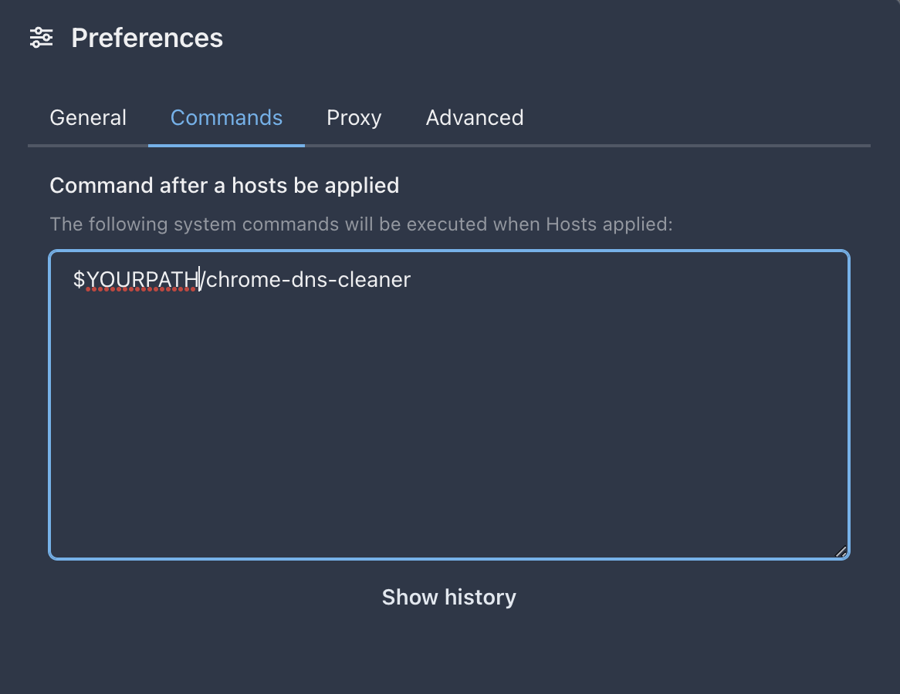

# Chrome Socket Killer

## Installation
Install NodeJs

MacOS
```
brew install nodejs
```
Windows

```
https://nodejs.org/en/download
```

Install Yarn
```
npm install -g yarn
```

## Dev
```
yarn 

node app.js
```
### Pack Project
```
yarn global add pkg

pkg . --output chrome-socket-killer
```

## Usage
### MacOS
Start Chrome with Debug Mode
```
sudo /Applications/Google\ Chrome.app/Contents/MacOS/Google\ Chrome --remote-debugging-port=9222  >/dev/null 2>&1 &
```

### Windows
```
"C:\Program Files (x86)\Google\Chrome\Application\chrome.exe" --remote-debugging-port=9222
```

### Run
```
./chrome-socket-killer
```

### Config on SwitchHosts



